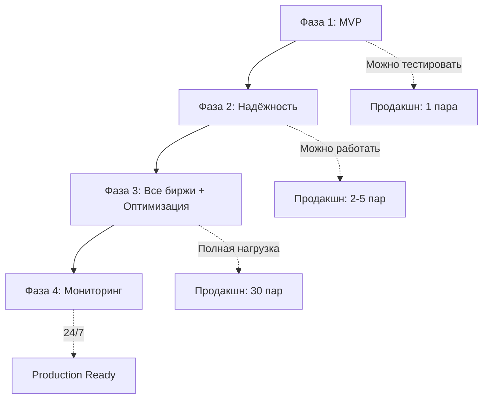

# План разработки торгового ядра

## Общая стратегия

**Принцип:** Итеративная разработка с ранним тестированием на продакшене.

**Цель каждой фазы:**
- Фаза 1: Минимальный работающий прототип (MVP) - **можно тестировать реально**
- Фаза 2: Надёжность и обработка ошибок - **готово к постоянной работе**
- Фаза 3: Все биржи и оптимизация - **полная функциональность**
- Фаза 4: Мониторинг и улучшения - **production-ready**

**Важно:** После Фазы 1 можно запускать бота с реальными деньгами (минимальные объёмы), чтобы проверить работу в боевых условиях.

---

---

## Фаза 1: Минимальный прототип (MVP)

**Цель:** Получить работающий бот, который может открыть и закрыть одну арбитражную позицию на 2 биржах.

**Критерии готовности:**
- ✅ Подключение к 2 биржам (например, Bybit + Bitget)
- ✅ Мониторинг цен через WebSocket
- ✅ Расчёт спреда с учётом комиссий
- ✅ Открытие позиции (2 ноги параллельно)
- ✅ Закрытие позиции по достижению целевого профита
- ✅ Базовая обработка ошибок (rollback если одна нога не открылась)
- ✅ Сохранение истории сделок в БД

**Что НЕ входит:**
- Вход/выход частями (только 1 ордер сразу)
- Stop Loss
- WebSocket reconnect (пока просто падаем при обрыве)
- Остальные 5 бирж
- Плечо (торгуем с leverage=1)
- Мониторинг метрик

---

### Задачи Фазы 1 (приоритет сверху вниз)

#### 1.1 Инфраструктура

| № | Задача | Описание | Время | Зависимости |
|---|--------|----------|-------|-------------|
| 1.1.1 | Настроить Go проект | `go.mod`, структура папок | 30 мин | - |
| 1.1.2 | PostgreSQL + миграции | Создать БД, таблицы `pairs`, `trades` | 1 час | - |
| 1.1.3 | Конфигурация | `configs/app.yaml`, загрузка через Viper | 1 час | - |

---

#### 1.2 Коннекторы бирж (только Bybit + Bitget)

| № | Задача | Описание | Время | Зависимости |
|---|--------|----------|-------|-------------|
| 1.2.1 | `exchanges/common.go` | Интерфейс `Exchange` | 30 мин | - |
| 1.2.2 | Bybit REST | `PlaceOrder()`, `GetBalance()` | 3 часа | 1.2.1 |
| 1.2.3 | Bybit WebSocket | Подключение, подписка на orderbook | 3 часа | 1.2.1 |
| 1.2.4 | Bitget REST | То же самое | 3 часа | 1.2.1 |
| 1.2.5 | Bitget WebSocket | То же самое | 3 часа | 1.2.1 |

**Итого раздел 1.2:** ~13 часов

---

#### 1.3 Мониторинг цен

| № | Задача | Описание | Время | Зависимости |
|---|--------|----------|-------|-------------|
| 1.3.1 | `prices/aggregator.go` | Сбор цен со всех бирж | 2 часа | 1.2.3, 1.2.5 |
| 1.3.2 | `prices/tracker.go` | Отслеживание лучших цен для символа | 2 часа | 1.3.1 |
| 1.3.3 | `orderbook/orderbook.go` | Расчёт средней цены исполнения | 1 час | - |

**Итого раздел 1.3:** ~5 часов

---

#### 1.4 Торговая логика (упрощённая)

| № | Задача | Описание | Время | Зависимости |
|---|--------|----------|-------|-------------|
| 1.4.1 | `state/machine.go` | State machine (только 4 состояния: PAUSED, READY, ENTERING, POSITION_OPEN) | 2 часа | - |
| 1.4.2 | `arbitrage/pair.go` | Базовая логика `Pair` + `OnPriceUpdate()` | 3 часа | 1.3.2, 1.4.1 |
| 1.4.3 | `arbitrage/entry.go` | Открытие позиции (1 ордер, без retry) | 4 часа | 1.4.2, 1.2.2, 1.2.4 |
| 1.4.4 | `arbitrage/exit.go` | Закрытие позиции (1 ордер) | 2 часа | 1.4.2 |
| 1.4.5 | `risk/balance.go` | Проверка баланса перед входом | 1 час | 1.2.2, 1.2.4 |

**Итого раздел 1.4:** ~12 часов

---

#### 1.5 Движок

| № | Задача | Описание | Время | Зависимости |
|---|--------|----------|-------|-------------|
| 1.5.1 | `engine/engine.go` | `TradingEngine` (без шардирования пока) | 3 часа | 1.3.1, 1.4.2 |
| 1.5.2 | `db/repository.go` | CRUD для `pairs` и `trades` | 2 часа | 1.1.2 |
| 1.5.3 | `cmd/main.go` | Точка входа, инициализация | 2 часа | 1.5.1, 1.5.2 |

**Итого раздел 1.5:** ~7 часов

---

#### 1.6 Тестирование MVP

| № | Задача | Описание | Время | Зависимости |
|---|--------|----------|-------|-------------|
| 1.6.1 | Unit-тесты | Критичные функции (расчёт спреда, state machine) | 3 часа | Все выше |
| 1.6.2 | Интеграционный тест | Запуск с testnet (если доступен) | 2 часа | Все выше |
| 1.6.3 | Первый запуск на продакшене | **Минимальный объём, 1 пара** | 1 час | Все выше |

**Итого раздел 1.6:** ~6 часов

---

### **Итого Фаза 1:** ~44 часа (~5-6 рабочих дней)

**Результат:** Работающий бот, который можно запустить с минимальными деньгами и проверить полный цикл арбитража.

---

---

## Фаза 2: Надёжность и обработка ошибок

**Цель:** Сделать бота надёжным, чтобы он мог работать 24/7 без вмешательства.

**Критерии готовности:**
- ✅ Вход/выход частями (N ордеров)
- ✅ Retry логика для второй ноги (3 попытки с backoff)
- ✅ Rollback при ошибках
- ✅ Stop Loss
- ✅ WebSocket reconnect (exponential backoff)
- ✅ Обработка при restart сервера
- ✅ Плавающее состояние (добор позиции)
- ✅ Установка плеча + кэш
- ✅ Лимит одновременных арбитражей

---

### Задачи Фазы 2

#### 2.1 Улучшение торговой логики

| № | Задача | Описание | Время | Зависимости |
|---|--------|----------|-------|-------------|
| 2.1.1 | Вход частями | Модифицировать `entry.go`: делить объём на N частей | 3 часа | Фаза 1 |
| 2.1.2 | Выход частями | Модифицировать `exit.go`: выход по частям | 2 часа | 2.1.1 |
| 2.1.3 | Плавающее состояние | Логика добора позиции при расширении спреда | 3 часа | 2.1.2 |
| 2.1.4 | Retry второй ноги | Добавить в `entry.go`: 3 попытки с backoff | 2 часа | 2.1.1 |
| 2.1.5 | Rollback первой ноги | Закрытие первой ноги если вторая не открылась | 2 часа | 2.1.4 |

**Итого раздел 2.1:** ~12 часов

---

#### 2.2 Stop Loss и мониторинг

| № | Задача | Описание | Время | Зависимости |
|---|--------|----------|-------|-------------|
| 2.2.1 | `arbitrage/monitor.go` | Мониторинг позиции каждую секунду | 3 часа | Фаза 1 |
| 2.2.2 | `risk/stoploss.go` | Проверка SL + расчёт PNL | 2 часа | 2.2.1 |
| 2.2.3 | Интеграция SL в `pair.go` | Вызов `handleStopLoss()` при срабатывании | 1 час | 2.2.2 |

**Итого раздел 2.2:** ~6 часов

---

#### 2.3 WebSocket reconnect

| № | Задача | Описание | Время | Зависимости |
|---|--------|----------|-------|-------------|
| 2.3.1 | Reconnect для Bybit | Exponential backoff, resubscribe | 3 часа | Фаза 1 |
| 2.3.2 | Reconnect для Bitget | То же самое | 2 часа | 2.3.1 |
| 2.3.3 | Обработка во время позиции | Держать позицию, продолжить после восстановления | 2 часа | 2.3.1 |

**Итого раздел 2.3:** ~7 часов

---

#### 2.4 Плечо и кэш

| № | Задача | Описание | Время | Зависимости |
|---|--------|----------|-------|-------------|
| 2.4.1 | `db/migrations/003_leverage_cache` | Таблица `leverage_cache` | 30 мин | Фаза 1 |
| 2.4.2 | REST: установка плеча | `SetLeverage()` для Bybit + Bitget | 2 часа | Фаза 1 |
| 2.4.3 | Кэширование плеча | Проверка кэша перед установкой | 1 час | 2.4.1, 2.4.2 |
| 2.4.4 | Интеграция в `entry.go` | Вызов `setLeverageIfNeeded()` перед входом | 1 час | 2.4.3 |

**Итого раздел 2.4:** ~4.5 часа

---

#### 2.5 Управление слотами

| № | Задача | Описание | Время | Зависимости |
|---|--------|----------|-------|-------------|
| 2.5.1 | `ArbitrageSlots` в `engine.go` | Ограничение одновременных арбитражей | 2 часа | Фаза 1 |
| 2.5.2 | Логика изменения лимита | Плавное уменьшение (дождаться завершения) | 1 час | 2.5.1 |

**Итого раздел 2.5:** ~3 часа

---

#### 2.6 Restart сервера

| № | Задача | Описание | Время | Зависимости |
|---|--------|----------|-------|-------------|
| 2.6.1 | Закрытие позиций при старте | `GetOpenPositions()` + закрыть все | 2 часа | Фаза 1 |
| 2.6.2 | Graceful shutdown | SIGINT/SIGTERM обработка | 1 час | Фаза 1 |

**Итого раздел 2.6:** ~3 часа

---

#### 2.7 Тестирование Фазы 2

| № | Задача | Описание | Время | Зависимости |
|---|--------|----------|-------|-------------|
| 2.7.1 | Unit-тесты | Retry, rollback, SL, reconnect | 4 часа | Все выше |
| 2.7.2 | Стресс-тест | Симуляция обрывов WebSocket | 2 часа | Все выше |
| 2.7.3 | Продакшн: 2 пары, 7 дней | Проверка стабильности | 1 час | Все выше |

**Итого раздел 2.7:** ~7 часов

---

### **Итого Фаза 2:** ~42.5 часа (~5 рабочих дней)

**Результат:** Надёжный бот, готовый к работе 24/7 с 2 парами на 2 биржах.

---

---

## Фаза 3: Все биржи + оптимизация

**Цель:** Подключить все 7 бирж и оптимизировать производительность для 30 пар.

**Критерии готовности:**
- ✅ Коннекторы для всех 7 бирж (BingX, Gate.io, OKX, HTX, MEXC)
- ✅ Шардирование событий (Coordinator)
- ✅ Object pooling для уменьшения GC
- ✅ Rate limiting для всех бирж
- ✅ Кэширование минимальных объёмов
- ✅ Оптимизация баланса (комбинированный подход)
- ✅ Латентность Tick→Order <5ms
- ✅ Поддержка 30 пар одновременно

---

### Задачи Фазы 3

#### 3.1 Коннекторы остальных бирж

| № | Задача | Описание | Время | Зависимости |
|---|--------|----------|-------|-------------|
| 3.1.1 | BingX | REST + WebSocket + parser | 6 часов | Фаза 2 |
| 3.1.2 | Gate.io | REST + WebSocket + parser | 6 часов | Фаза 2 |
| 3.1.3 | OKX | REST + WebSocket + parser (+ passphrase) | 7 часов | Фаза 2 |
| 3.1.4 | HTX | REST + WebSocket + parser | 6 часов | Фаза 2 |
| 3.1.5 | MEXC | REST + WebSocket + parser | 6 часов | Фаза 2 |
| 3.1.6 | Reconnect для всех новых бирж | То же самое что в Фазе 2 | 4 часа | 3.1.1-3.1.5 |

**Итого раздел 3.1:** ~35 часов

---

#### 3.2 Шардирование

| № | Задача | Описание | Время | Зависимости |
|---|--------|----------|-------|-------------|
| 3.2.1 | `engine/coordinator.go` | Создание N шардов, routing | 4 часа | Фаза 2 |
| 3.2.2 | Интеграция в `engine.go` | Замена прямой обработки на шарды | 2 часа | 3.2.1 |
| 3.2.3 | Тестирование шардирования | 30 пар на 6 биржах = 180 потоков | 2 часа | 3.2.2 |

**Итого раздел 3.2:** ~8 часов

---

#### 3.3 Rate limiting

| № | Задача | Описание | Время | Зависимости |
|---|--------|----------|-------|-------------|
| 3.3.1 | `pkg/ratelimit/limiter.go` | Token Bucket алгоритм | 2 часа | - |
| 3.3.2 | Интеграция в REST клиенты | Каждый `doRequest()` проверяет лимит | 2 часа | 3.3.1 |
| 3.3.3 | Конфигурация лимитов | `configs/exchanges.json` + загрузка | 1 час | 3.3.2 |

**Итого раздел 3.3:** ~5 часов

---

#### 3.4 Кэширование минимумов

| № | Задача | Описание | Время | Зависимости |
|---|--------|----------|-------|-------------|
| 3.4.1 | Загрузка минимумов при старте | REST запросы ко всем биржам | 3 часа | Фаза 3.1 |
| 3.4.2 | In-memory кэш | Хранение в `map[string]OrderLimits` | 1 час | 3.4.1 |
| 3.4.3 | Обновление раз в сутки | Cron-like механизм | 1 час | 3.4.2 |
| 3.4.4 | Проверка при добавлении пары | Валидация объёма на всех биржах | 1 час | 3.4.2 |

**Итого раздел 3.4:** ~6 часов

---

#### 3.5 Object pooling

| № | Задача | Описание | Время | Зависимости |
|---|--------|----------|-------|-------------|
| 3.5.1 | `pkg/pool/object_pool.go` | Пулы для `PriceUpdate`, `BestPrices` | 2 часа | - |
| 3.5.2 | Интеграция в `prices/` | Использовать пулы вместо `new()` | 2 часа | 3.5.1 |

**Итого раздел 3.5:** ~4 часа

---

#### 3.6 Оптимизация баланса

| № | Задача | Описание | Время | Зависимости |
|---|--------|----------|-------|-------------|
| 3.6.1 | Комбинированный подход | REST для первой части, кэш для остальных | 2 часа | Фаза 2 |
| 3.6.2 | Вычитание маржи из кэша | После каждого входа обновить кэш | 1 час | 3.6.1 |

**Итого раздел 3.6:** ~3 часа

---

#### 3.7 Тестирование производительности

| № | Задача | Описание | Время | Зависимости |
|---|--------|----------|-------|-------------|
| 3.7.1 | Бенчмарки | Латентность Tick→Order, парсинг JSON | 3 часа | Все выше |
| 3.7.2 | Профилирование | pprof для поиска bottleneck'ов | 2 часа | 3.7.1 |
| 3.7.3 | Продакшн: 30 пар, 7 дней | Проверка стабильности | 2 часа | Все выше |

**Итого раздел 3.7:** ~7 часов

---

### **Итого Фаза 3:** ~68 часов (~8-9 рабочих дней)

**Результат:** Полнофункциональный бот, способный обрабатывать 30 пар на 7 биржах с латентностью <5ms.

---

---

## Фаза 4: Мониторинг и улучшения

**Цель:** Production-ready система с мониторингом и возможностью расширения.

**Критерии готовности:**
- ✅ Prometheus метрики
- ✅ Grafana дашборды
- ✅ Алерты (Telegram/Email)
- ✅ Логирование в JSON формате
- ✅ REST API для фронтенда
- ✅ Документация API

---

### Задачи Фазы 4

#### 4.1 Метрики и мониторинг

| № | Задача | Описание | Время | Зависимости |
|---|--------|----------|-------|-------------|
| 4.1.1 | `pkg/metrics/prometheus.go` | Регистрация метрик | 2 часа | - |
| 4.1.2 | Инструментация кода | Добавить метрики в критичные места | 4 часа | 4.1.1 |
| 4.1.3 | Grafana дашборды | Визуализация метрик | 3 часа | 4.1.2 |
| 4.1.4 | Алерты | Telegram bot для критичных событий | 3 часа | 4.1.2 |

**Итого раздел 4.1:** ~12 часов

---

#### 4.2 Логирование

| № | Задача | Описание | Время | Зависимости |
|---|--------|----------|-------|-------------|
| 4.2.1 | Структурированное логирование | Zerolog или Zap в JSON формате | 2 часа | - |
| 4.2.2 | Ротация логов | Log rotation (по размеру/времени) | 1 час | 4.2.1 |

**Итого раздел 4.2:** ~3 часа

---

#### 4.3 REST API для фронтенда

| № | Задача | Описание | Время | Зависимости |
|---|--------|----------|-------|-------------|
| 4.3.1 | API handlers | CRUD для пар, start/pause | 4 часа | Фаза 2 |
| 4.3.2 | WebSocket для событий | Real-time обновления статусов | 3 часа | 4.3.1 |
| 4.3.3 | Swagger документация | OpenAPI spec | 2 часа | 4.3.1 |

**Итого раздел 4.3:** ~9 часов

---

#### 4.4 Документация

| № | Задача | Описание | Время | Зависимости |
|---|--------|----------|-------|-------------|
| 4.4.1 | README.md | Установка, запуск, конфигурация | 2 часа | Все выше |
| 4.4.2 | Troubleshooting guide | Решение типичных проблем | 2 часа | Все выше |

**Итого раздел 4.4:** ~4 часа

---

### **Итого Фаза 4:** ~28 часов (~3-4 рабочих дня)

**Результат:** Production-ready система с полным мониторингом и документацией.

---

---

## Общая оценка времени

| Фаза | Время | Описание |
|------|-------|----------|
| **Фаза 1** | ~44 часа (5-6 дней) | MVP: 1 пара, 2 биржи, базовая логика |
| **Фаза 2** | ~42.5 часа (5 дней) | Надёжность: частичный вход/выход, SL, reconnect |
| **Фаза 3** | ~68 часов (8-9 дней) | Все биржи + оптимизация для 30 пар |
| **Фаза 4** | ~28 часов (3-4 дня) | Мониторинг, API, документация |
| **ИТОГО** | **~182.5 часа** | **~22-24 рабочих дня (1 месяц)** |

**Примечание:** Оценки времени для 1 разработчика, работающего full-time. Если работать 4-6 часов в день, умножить на 1.5-2x.

---

---

## Стратегия тестирования

### После Фазы 1
- ✅ Запустить с **минимальным объёмом** (например, 0.001 BTC)
- ✅ Проверить **1 полный цикл** арбитража (вход → выход)
- ✅ Если всё работает → оставить на **24 часа**
- ⚠️ Если ошибки → исправить, повторить

### После Фазы 2
- ✅ Добавить **2 пары**, увеличить объём до **реального**
- ✅ Проверить **вход частями** (3-5 ордеров)
- ✅ Симулировать **обрыв WebSocket** (убить соединение вручную)
- ✅ Проверить **Stop Loss** (вручную создать убыточную ситуацию)
- ✅ Оставить на **7 дней**

### После Фазы 3
- ✅ Добавить **10-20 пар** на **всех биржах**
- ✅ Проверить латентность через метрики
- ✅ Оставить на **14 дней**

### После Фазы 4
- ✅ Полная нагрузка: **30 пар**, **реальные объёмы**
- ✅ Настроить алерты
- ✅ Production mode → **непрерывная работа**

---

---

## Риски и как их минимизировать

| Риск | Вероятность | Влияние | Меры |
|------|-------------|---------|------|
| Потеря средств из-за бага | Средняя | Критичное | Начать с минимальных объёмов, тестировать каждую фазу |
| Биржа заблокирует аккаунт | Низкая | Высокое | Соблюдать rate limits (50% от максимума) |
| WebSocket обрывается часто | Средняя | Среднее | Reconnect логика + мониторинг |
| Латентность >5ms | Низкая | Среднее | VPS в Сингапуре, профилирование кода |
| Неправильный расчёт PNL | Низкая | Высокое | Unit-тесты для всех расчётов |
| Ликвидация позиции | Низкая | Критичное | Stop Loss + мониторинг маржи |

---

---

## Зависимости между фазами

---

---

## Чеклист готовности к продакшену

### После Фазы 1 (минимальный запуск)
- [ ] Подключены 2 биржи (Bybit, Bitget)
- [ ] WebSocket работает стабильно
- [ ] Полный цикл арбитража выполнен успешно
- [ ] История сделок сохраняется в БД
- [ ] Базовый rollback при ошибках работает
- [ ] Запущено с минимальным объёмом, работает 24 часа без сбоев

### После Фазы 2 (надёжная работа)
- [ ] Вход/выход частями работает (N ордеров)
- [ ] Retry логика для второй ноги (3 попытки)
- [ ] Stop Loss срабатывает корректно
- [ ] WebSocket reconnect восстанавливает подключение
- [ ] Позиция держится во время reconnect
- [ ] Restart сервера закрывает все позиции
- [ ] Плечо устанавливается автоматически + кэш
- [ ] Лимит одновременных арбитражей работает
- [ ] 2 пары работают 7 дней без вмешательства

### После Фазы 3 (полная функциональность)
- [ ] Подключены все 7 бирж
- [ ] Reconnect работает для всех бирж
- [ ] Шардирование распределяет нагрузку
- [ ] Object pooling уменьшил GC паузы
- [ ] Rate limiting предотвращает блокировки
- [ ] Кэш минимальных объёмов обновляется
- [ ] Латентность Tick→Order <5ms (90-й перцентиль)
- [ ] 30 пар работают одновременно без проблем
- [ ] 7 дней непрерывной работы без сбоев

### После Фазы 4 (production-ready)
- [ ] Prometheus метрики экспортируются
- [ ] Grafana дашборды показывают ключевые метрики
- [ ] Алерты в Telegram работают
- [ ] Логи пишутся в JSON и ротируются
- [ ] REST API работает для фронтенда
- [ ] Swagger документация доступна
- [ ] README и troubleshooting guide написаны
- [ ] Все тесты проходят (unit + integration)

---
